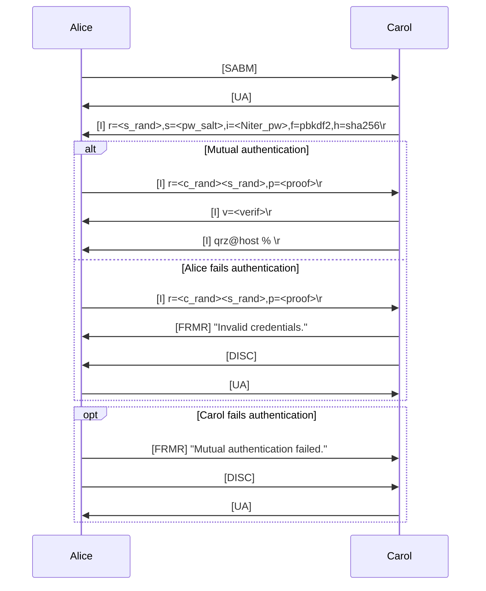

# hamsp
Mutual authentication and password rotation scheme for ham radio

Most countries mandate licensed operators not to obscure the meaning of their exchanges.
The following document defines an authentication mechanism to improve and supersede CRAM-MD5, and a secure password rotation scheme to mutually authenticate a user and a remote entity to then securely transfer sensitive keying material, while ensuring its integrity.

## HSCRAM

TODO: completely specify fields

## Secure password rotation scheme
The following mechanism:
  1. Mutually authenticates the client and the remote party, then generate an ephemeral key encryption key (`KEK`) through OPAQUE.
  2. Protects the new keying material with the `KEK` against eavesdropping and unintended modification (using an AEAD such as AES256-GCM or CHACHA20-POLY1305).
  3. Confirms completion of rekeying.

TODO: flow graph and field specification

### Passwords
TODO

### Baycomm authentication
TODO
