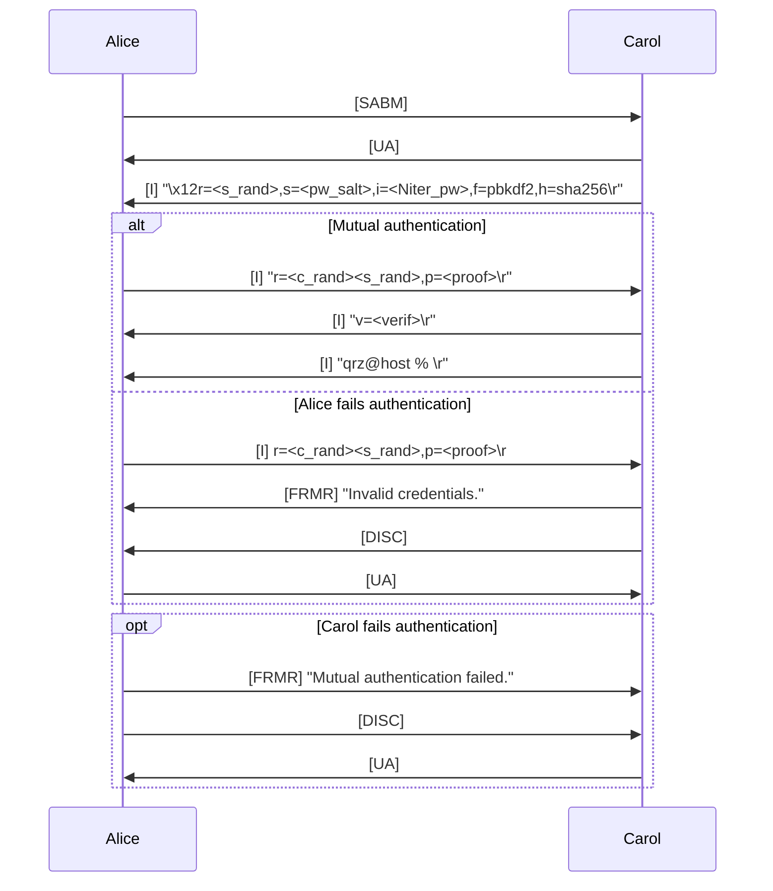
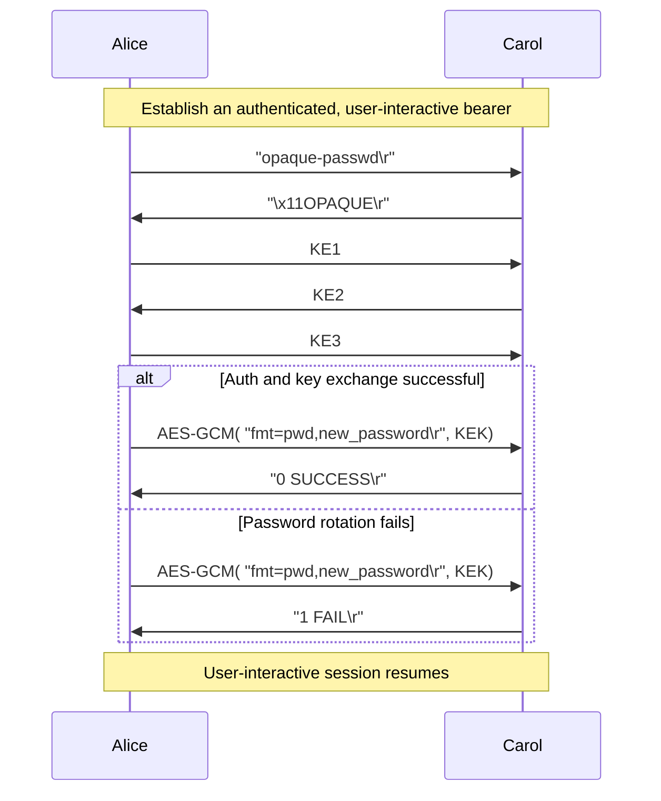

# hamsp
Mutual authentication and password rotation scheme for ham radio

Most countries mandate licensed operators not to obscure the meaning of their exchanges.
The following document defines an authentication mechanism to improve and supersede CRAM-MD5, and a secure password rotation scheme to mutually authenticate a user and a remote entity to then securely transfer sensitive keying material, while ensuring its integrity.

## HSCRAM
HSCRAM is inspired from the SCRAM-SHA256 mechanism. By default, the remote party implies the user name from the AX.25 source callsign and slightly changes the exchange to reduce the number of required modem turnarounds from 4 to 3.

TODO: completely specify fields

## Secure password rotation scheme
The following mechanism:
  1. Mutually authenticates the client and the remote party, then generate an ephemeral key encryption key (`KEK`) through OPAQUE.
  2. Protects the new keying material with the `KEK` against eavesdropping and unintended modification (using an AEAD such as AES256-GCM or CHACHA20-POLY1305).
  3. Confirms completion of rekeying.

TODO: flow graph and field specification

### Cleartext Passwords
When the transfered keying material is a cleartext password, the `fmt` attribute is set to `pwd`.

Security Note: it is strongly advised to securely store the user's password using a publicly-recognized password storage function on the server side. Refer to HSCRAM for more details.

### Baycom authentication
When the transfered keying material is a baycom password, the `fmt` attribute is set to `baycom`.
